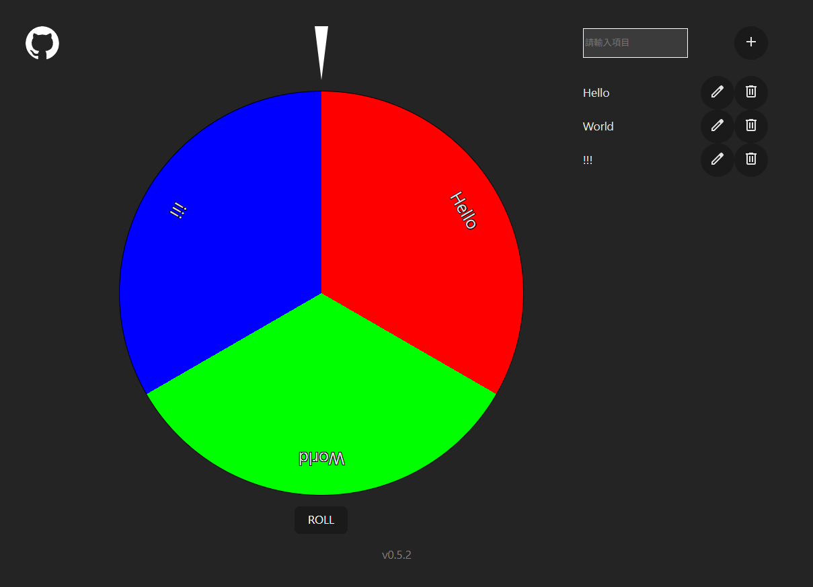

# 轉盤

練習React的side project

## How to start

於終端機輸入
```
npm install
```

開發
```
npm run dev
```

打包
```
npm run build
```

## 功能說明
[demo site](https://regg408.github.io/roulette.gitbub.io/)


- 右側清單可新增或移除項目，左側轉盤會做相對應的改變
- 點擊開始旋轉轉盤，轉速是隨機的
- 點擊停止將隨機抽出一個緩動函數，讓轉盤慢慢停下

## 附錄
- 緩動函數參考自: <https://easings.net/zh-tw#>
- 圖示來自: <https://fonts.google.com/icons>